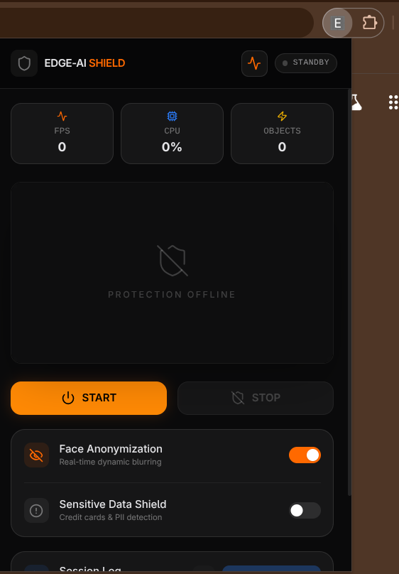

<div align="center">

</div>

# Edge-AI Shield: Real-time Privacy Protection 🛡️

**Edge-AI Shield** is a powerful Chrome Extension providing real-time AI-powered privacy protection. It dynamically blurs faces and sensitive information (PII) directly in your browser's camera feed. 

🏆 **Hackathon General Championship Winner!** 🏆
This project was proudly built during a hackathon by our college tech team, and we won the General Championship because of this innovative build!

## ✨ Key Features
- **Face Anonymization**: Real-time detection and blurring of non-user faces.
- **Sensitive Data Shield**: AI-powered (Gemini) detection of credit cards, emails, and phone numbers with automatic blurring.
- **Session Logging**: Tracks FPS, CPU usage, and privacy events with CSV export functionality.
- **Optimized for Extension**: Complies with Manifest V3 (MV3) security standards using local WASM and model bundling.
- **Admin Dashboard & Node Server** *(New Addons)*: A dedicated local dashboard with a Node.js backend to monitor telemetry data and manage privacy events in real-time.

---

## 🏗️ Architecture & Addons

### 1. Chrome Extension (Core)
The main component deployed to the browser that runs the local ML models (MediaPipe Tasks-Vision) and interfaces with Large Language Models (Gemini) to process video frames in real-time.

### 2. Node.js Telemetry Server
A robust backend Node server designed to receive real-time telemetry from the Chrome extension, including:
- CPU & Memory usage stats.
- Active frame rates (FPS) monitoring.
- Logs of detected faces and PII events.

### 3. Admin Dashboard
A React + Vite frontend that acts as the control center:
- **Live Monitoring**: Visualizes incoming telemetry data.
- **Event Insights**: Displays detailed logs of privacy interventions and AI detections.
- **Data Export**: Export capabilities (CSV, JSON, Drive) for audit and review.

---

## 🚀 Installation & Setup

### Prerequisites
- Node.js (v18+)
- Google Chrome browser

### 1. Build the Chrome Extension
```bash
npm install
npm run build
```
### 2. Configure API Key
Set up your `GEMINI_API_KEY` in your environment or during build if using a `.env` file for the Gemini PII detection feature.

### 3. Load in Chrome
1. Open Chrome and navigate to `chrome://extensions/`.
2. Enable **Developer mode** (top right).
3. Click **Load unpacked**.
4. Select the **`dist`** folder (e.g., `/path/to/project/dist`).

### 4. Run the Admin Dashboard & Node Server
*Navigate to the admin-dashboard or server directory and start the processes:*
```bash
cd admin-dashboard
npm install
npm run dev

# In another terminal, start the Node server:
node server.js
```

---

## 🛠️ Tech Stack
- **Frontend**: React, Vite, Styled with Tailwind CSS, Lucide Icons, and Framer Motion.
- **Backend**: Node.js, Express.
- **AI/ML Engine**: MediaPipe Tasks-Vision (Local Face Detection via WASM).
- **LLM**: Google Gemini API (Sensitive text and PII scanning).

---

## 👨‍💻 Contributors & Tech Team

We are proud to have built this as part of our college tech team.
- **Machine Learning Engineer**: [Shambhavi](https://github.com/shambhavi-1)
- **System Designer**: [Mahantesh](https://github.com/mahantesh-git)
- **Product Engineer**: [Nikhil/Handay](https://github.com/nikhilmanvi360)

---
<div align="center">
<i>Built with ❤️ for privacy and security.</i>
</div>
